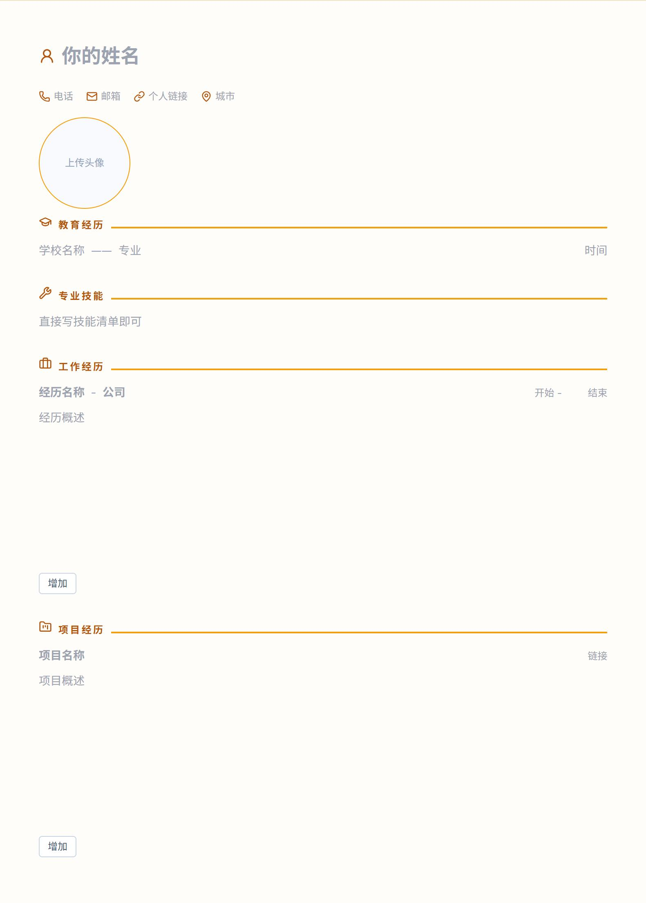

# AI 简历生成器

一个可直接编辑的简历模板，支持 AI 美化与 PDF 导出。面向大众“开箱即用”，无需额外配置即可在线体验。

[](https://ai-resume-generator-xi-five.vercel.app/)


## 功能
- 支持直接在模板上编辑
- 支持 AI 美化：一键自动润色内容表达
- PDF 一键导出
- 有三种风格模板选择

## 模板预览

**经典蓝**


**暖调橙**


**极简黑**


## 其他说明

### 关于 AI 美化功能限流

为避免滥用，默认限制为 **30 次/天/IP**。  

> 注意：当前是内存限流，服务重启会清零；多实例部署时各实例独立计数。

### 关于pdf导出

当前导出逻辑对 Chromium 内核（Chrome/Edge）最稳；其它浏览器（如 Firefox、国产定制浏览器）可能仍有兼容性差异。请优先使用 Chrome/Edge 作为默认浏览器。

## 面向开发者

环境准备
- Node.js 18+（建议 20 LTS）
- npm

本地启动
1. 安装依赖：`npm install`
2. 配置环境变量（`.env.local`）：
- `ZHIPU_API_KEY`（必填）：智谱 API Key
- `ZHIPU_BASE_URL`（可选）：API 网关地址，默认 `https://open.bigmodel.cn/api/paas/v4`
- `ZHIPU_MODEL`（可选）：模型名称，默认 `glm-4.7-flash`

示例：
```bash
ZHIPU_API_KEY=你的密钥
ZHIPU_BASE_URL=https://open.bigmodel.cn/api/paas/v4
ZHIPU_MODEL=glm-4.7-flash
```

如何更换模型：
- 直接修改 `ZHIPU_MODEL` 为你想用的模型名（以智谱控制台显示为准）
- 如果改用其他服务商/自建网关，修改 `ZHIPU_BASE_URL` 指向新的 API 网关，并替换对应的 `ZHIPU_API_KEY`
- 修改后需要重启开发服务器

3. 启动开发服务器：`npm run dev`

构建与部署
- 构建：`npm run build`
- 本地预览：`npm run start`

其他
- 代码检查：`npm run lint`

## LICENSE

MIT
